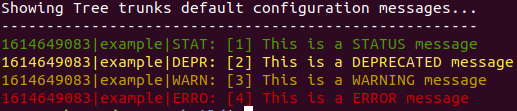
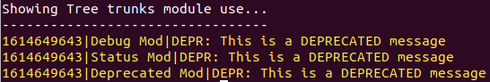
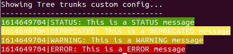
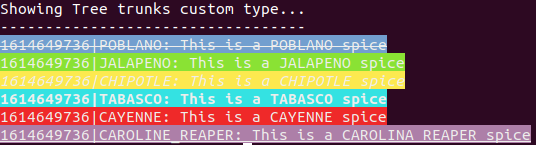

# Tree Trunks

**Tree Trunks** is a simple C++17 log system.  


As features:

* Compile-time processing: as much as possible, all messages defined above *max level* will be removed;
* Header only, works out of the box;
* Create your own *log level*, definitions (*colors*, *names*...) and *behaviour*;
* Concept of module, indentifing locally log name and managing *log levels*.

> All coloring is made in a **ANSI escape sequeces** standard. Not all terminal support it, or support different features. [Here](https://en.wikipedia.org/wiki/ANSI_escape_code) you can explore a list of commands and terminal support.
  
## Dependencies

**Tree Trunks** depends only of a C++17 compiler.

You can use [git](https://git-scm.com/) to download (as shown below), and, to compile the examples, you need to have [CMake](https://cmake.org/) installed. 

## Download and compile

You can download **Tree Trunks** using `git`:

```
$ git clone https://github.com/rnascunha/tree_trunks.git
$ cd tree_trunks
```

Now, just copy the folder `tt` inside `src/include` to your project, and point the include path accordingly.

To test the examples, run:

```
#create a build directory and enter
$ mkdir build
$ cd build

$ cmake -Dexample=<tt_default|custom_config|custom_type|modules> ..
$ make

#execute
$ ./<example_name>
```
## Testing


As I think that the best way of learning something is using, let's go throght the examples. You will realize that use/configure **Tree Trunks** is like follow a delicious apple pie recipe.

### Default

The default configuration is made to use **Tree Trunks** out of the box. The `tt_default` examples is a good starting point.

```
$ cmake -Dexample=tt_default ..
$ make
$ ./tt_default
```


It defines the follwing *log levels*:

```
enum class type{
	none = 0,
	error,
	warning,
	deprecated,
	status,
	debug,
};
```
You can configure the default behaviour with the folliwing macros, and then including `tt/tt.hpp` header:

```
/**
 * Uncometing any definition below will CHANGE the default behaviour
 */
//#define TT_USE_COLOR 			false	///< Will remove any color settings
//#define TT_USE_TIME			false	///< Will remove time output at log
//#define TT_USE_MODULE			false	///< Will show the module name (if present) at output
//#define TT_IGNORE_MODULE_LEVEL	true	///< Will ignore any module max level setting
//#define TT_USE_LOG_NAME		true	///< Will print the log name ("DEBUG", "STATUS", "WARNING"...)
//#define TT_USE_SHORT_LOG_NAME		false	///< Will not print short log name ("DEBG", "STAT", "WARN" ...)
//#define TT_NAME			"MyLog"	///< Will set a name to the default configuration

/**
 * Define a log level (uncomment just one line)
 */
//#define TT_LEVEL type::error
//#define TT_LEVEL type::warning
//#define TT_LEVEL type::deprecated
//#define TT_LEVEL type::status			///< default
//#define TT_LEVEL type::debug
//#define TT_LEVEL type::none

#include "tt/tt.hpp"
```
And the log (convenient) functions are, in a *printf-like* style:

```
tt::debug(/* stream output */, /* module */, format, ...);
tt::status(/* stream output */, /* module */, format, ...);
tt::deprecated(/* stream output */, /* module */, format, ...);
tt::warning(/* stream output */, /* module */, format, ...);
tt::error(/* stream output */, /* module */, format, ...);
```
All this functions have overload with/without `stream output` and `module`. `stream output` is defaulted to `stdout`.

Use `tt/tt.hpp` as a template to make your own log configuration.

> As the default configuration depends on macros (how to remove that?) its recomended that the lines above be put at a separate header (don't forget the *header guards*), and this new file be spread around the project. Or pass the definition at command line.
 
### Modules

The use of modules can be seen at the `modules` example:



```
$ cmake -Dexample=modules ..
$ make
$ ./modules
```
Modules are a way to locally give the log a name and define a *log level*. To define a module:

```
static constexpr tt::module <module_name> = {
	.name = <name>,
	.max_level = <log_level>,
	.enable = true
};
```
The `max_level` attribute will decide if the message should or not be displayed (if this attibute is higher than the global definition, it will be ignored). You can change this behaviour setting `enable=false` or globally setting `ignore_module_level/TT_IGNORE_MODULE_LEVEL` equal to `true`.

### Custom configuration

The example `custom_config` shows how to make your own configuration (using the default *log levels*). As the picture shows, we swap the foreground/background colors.



```
$ cmake -Dexample=custom_config ..
$ make
$ ./custom_config
```
Two new structures must be defined:

```
/**
 * We are going to use the same level definition of the the default
 */
using type = tt::type;

/**
 * Definition of the output
 * As type::none doesn't have a definition, its always ignored
 */
static constexpr const Tree_Trunks::type_config<type> type_config[] = {
	//Level			//Long name	//Short name	//Color definition
	{type::error, 		"ERROR", 	"ERRO",		BG_RED},
	{type::warning,		"WARNING", 	"WARN",		BG_YELLOW},
	{type::deprecated, 	"DEPRECATED", 	"DEPR",		BG_BRIG_YELLOW},
	{type::status, 		"STATUS", 	"STAT", 	BG_GREEN},
	{type::debug, 		"DEBUG", 	"DEBG",		BG_BLUE}
};

/**
 * Configuration
 */
static constexpr const Tree_Trunks::config<type, size_config> config = {
	.use_color 		= true,		//Show (or not) colors

	.time 				= true,		//Show (or not) timestamp
	.module				= true,		//Show (or not) module name (if present)
	.ignore_module_level = true,		//Ignore (or not) modules level
	.log_name 			= true,		//Show (or not) log name
	.log_sname 		= false,	//Show (or not) short log name
	.name 			= nullptr,	//Specify a name to the configuration (will be shown at the output)
	.max_level 		= type::status,	//Define the configuration max_level
	.tp_config 		= type_config	//The type configuration defined above
};
```
All configurations are exaplained above. After everything set, it's desirable to define some convience functions, to make the calls friendlier:

```
template<type MinType, typename ...Args>
constexpr std::size_t log(Args&& ... args) noexcept
{
	return Tree_Trunks::log<type, MinType, config>(std::forward<Args>(args)...);
}
```
Check `tt/tt.hpp` to examine how to make other very convinient functions.

### Custom type

The `custom_type` example is just as the `custom_config`, adding that we are going to define our own *log levels*!



```
$ cmake -Dexample=custom_type ..
$ make
$ ./custom_type
```

Defining the *log levels*:

```
/**
 * Define the log levels that you want
 */
enum class type{
	red_chile = 0,
	carolina_reaper,
	cayenne,
	tabasco,
	chipotle,
	jalapeno,
	poblano,
};
```

The remaning is just copy/paste from the previous example (like a apple pie recipe).
 
## Others

* There is a facility header `tt/color.hpp` with some (all?) **ANSI escape sequeces** defined. After using, include the `tt/uncolor.hpp` that will undefine everything, and prevent any macro side effect to your code. The `tt/tt.hpp` also call this two headers, so if you are going to include it, do it after this header (otherwise any color define will be unset inside de default header). 
